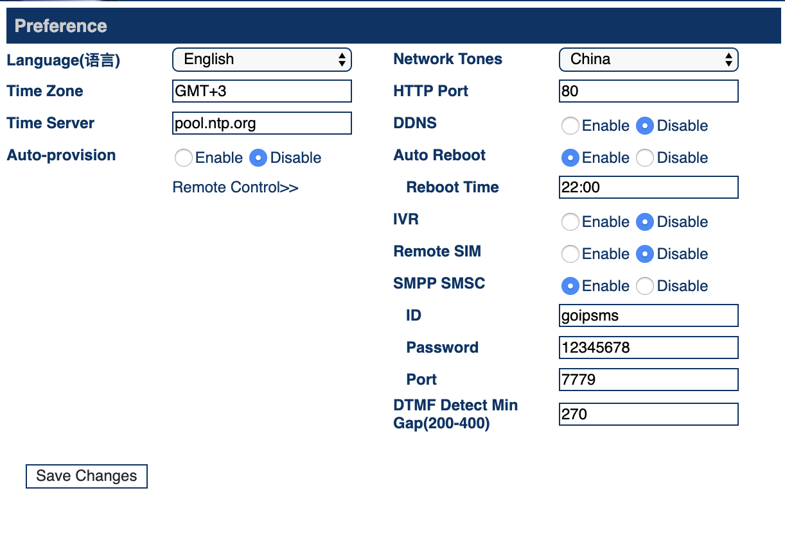

`Telegram smpp sms bot (via python-smpplib)`
================

SMPP library for Python. Forked from [GitHub](https://github.com/python-smpplib/python-smpplib) and changed for GSM gate GOIP 4.

This python script read SMS from GOIP GSM gate via SMPP protocol and forward it to telegram chat. 

To use this function you need: 
1. Change settings on your GOIP GSM gate: 

- go to Configuration -> Preference on web interface in your gate;
- enable `SMPP SMSC`;
- fill `ID` field;
- fill `Password` field;
- fill `Port` field;
- and save changes.

2. Copy file [settings.yaml.example](settings.yaml.example) to `settings.yaml` and fill it.

| **Top level settings** | **Sub-level settings** | **Discription**                                   | **Example**                                       |
|--------------------|--------------------|-----------------------------------------------|-----------------------------------------------|
| log_level          |                    | Log level (it's may be: NOTSET, DEBUG, INFO, WARNING, ERROR, CRITICAL)                                    | DEBUG                                         |
| telegram           |                    |                                               |                                               |
|                    | bot_token          | Telegram bot token                            | '00000000000:xxxxxxxxxxxxxxxxxxxxxxxxxxxxxxx' |
|                    | channel_id         | Telegram channel id                           | '-10000000000000'                             |
|                    | proxy_enabled         | `True` for enable use socks5 proxy to connect telegram api                            | False                             |
|                    | proxy_host         | Socks5 proxy host for telegram connection     | 'socks5://SOCKS5_IP_ADDR:1881'                |
|                    | proxy_login        | Socks5 login                                  | 'SOCKS_LOGIN'                                 |
|                    | proxy_pass         | Socks5 password                               | 'SOCKS_PASSWD'                                |
| smpp_goip          |                    |                                               |                                               |
|                    | host               | IP or hostname of your GOIP GSM gate          | 'GOIP_IP_ADDR'                                |
|                    | port               | Port of SMPP your GOIP GSM gate               | 7777                                          |
|                    | system_id          | ID of your GOIP GSM gate (from SMPP settings) | 'GOIP_SYSTEM_ID'                              |
|                    | password           | Password                                      | 'GOIP_SMPP_PASS'                              |
|                    | sim_num            | Phone number of your SIM                      | 'GOIP_SIM_NUM'                                |

**TIP**. When you fill field `system_id` like in GOIP GSM gate - you will receive SMS from all channels of your gate. If you want to receive SMS from certain channel - you need to use `system_id` + `0` + `channel_num`. For example: you want to receive SMS from channel `2` - fill `system_id02`, from channel `4` - fill `system_id04` and etc.

3. Run it in Docker, uses commands: 
  - `docker-compose build`;
  - `docker-compose up -d`.

